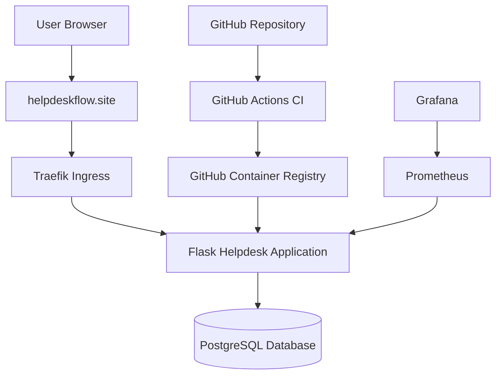

# IT Helpdesk Platform

A production-style IT Helpdesk and Ticketing Platform built to demonstrate practical DevOps, cloud deployment, security, CI/CD, containerization, Kubernetes, and monitoring skills.

**Live Application:** https://helpdeskflow.site
**Health Check:** https://helpdeskflow.site/health

---

## Project Overview

This project provides a web-based helpdesk platform where users can register, log in, manage their account, and create or manage support tickets according to their assigned role.

It was built as a hands-on DevOps portfolio project and deployed to a real AWS cloud environment.

## Key Features

* User registration and secure login
* Role-based access control for Users, Technicians, and Administrators
* First-time administrator setup
* Ticket creation and management
* Admin user management
* PostgreSQL database integration
* Application health endpoint for monitoring
* HTTPS-secured public deployment
* Responsive web interface

## Technology Stack

| Area               | Technology                          |
| ------------------ | ----------------------------------- |
| Backend            | Python, Flask                       |
| Database           | PostgreSQL                          |
| ORM                | SQLAlchemy                          |
| Authentication     | Flask sessions and password hashing |
| Testing            | Pytest                              |
| Containerization   | Docker                              |
| CI                 | GitHub Actions                      |
| Security Scanning  | Anchore                             |
| Container Registry | GitHub Container Registry (GHCR)    |
| Orchestration      | Kubernetes / K3s                    |
| Cloud Hosting      | AWS EC2                             |
| Ingress            | Traefik                             |
| HTTPS Certificates | cert-manager and Let's Encrypt      |
| Monitoring         | Prometheus and Grafana              |
| Domain and DNS     | Namecheap                           |

## Deployment Architecture



## DevOps Workflow

1. Code is pushed to the GitHub repository.
2. GitHub Actions runs automated tests.
3. A Docker image is built for the application.
4. Anchore scans the image for known vulnerabilities.
5. The validated Docker image is published to GitHub Container Registry.
6. The new image is deployed manually to the Kubernetes cluster on AWS.
7. Traefik exposes the application through the custom domain.
8. cert-manager automatically manages the Let's Encrypt HTTPS certificate.
9. Prometheus and Grafana provide monitoring capability.

## Security

* HTTPS is enabled with a valid Let's Encrypt certificate.
* HTTP traffic redirects permanently to HTTPS.
* Passwords are securely hashed before database storage.
* Sensitive configuration is kept outside the application source code where possible.
* Docker image vulnerability scanning runs in CI.
* Kubernetes separates application components into managed workloads.

## Run Locally

### Prerequisites

* Python 3
* PostgreSQL
* Docker Desktop or Docker Engine
* Git

### Clone the Repository

```bash
git clone https://github.com/haroonranaspy7/devops-helpdesk.git
cd devops-helpdesk
```

### Run with Docker

```bash
docker build -t helpdesk-platform .
docker run -p 5000:5000 helpdesk-platform
```

Then open:

```text
http://localhost:5000
```

## Health Check

The application exposes a health endpoint for uptime checks, load balancers, and monitoring systems:

```text
/health
```

Example response:

```json
{
  "status": "healthy"
}
```

## Project Status

* Application development: Complete
* Docker containerization: Complete
* Automated testing: Complete
* GitHub Actions CI pipeline: Complete
* Container security scanning: Complete
* Kubernetes deployment: Complete
* AWS cloud deployment: Complete
* Custom domain and HTTPS: Complete
* Monitoring stack: Complete

## Author

**Haroon Rana**
Associate / Junior DevOps Engineer

* GitHub: https://github.com/haroonranaspy7
* LinkedIn: https://www.linkedin.com/in/rana-muhammad-haroon-29017128a/
* Email: [haroonrana1029@gmail.com](mailto:haroonrana1029@gmail.com)

## Copyright Notice

Copyright © 2026 Haroon Rana. All rights reserved.

This repository is shared as a portfolio project. For commercial use, redistribution, collaboration, or permission to reuse substantial parts of this project, please contact:

**[haroonrana1029@gmail.com](mailto:haroonrana1029@gmail.com)**
